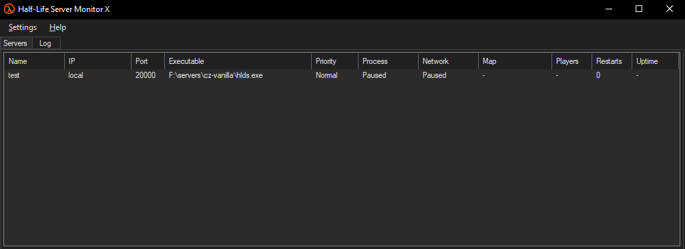

# HLSMX (Half-Life Server Monitor X)

Server Monitor for most Valve games.

Based on *CF Server Monitor* by ChunFeng (2024), and *Half-Life Server Monitor* by Rulzy (2011).

Windows only.

## Features

- Drop-in replacement for HLSM/CFMonitor.
- Automatically imports HLSM and CFSM configurations.
- Monitors most Valve server executables.
- Templates for common games.
- Scheduled restarts/starts/stops.
- Webhook notifications (Discord, etc.).
- Can run as a Windows service.

## Usage

1. Download release, extract, and run `hlsmx.exe`.

## Requirements

* [.NET Framework 4.0](https://dotnet.microsoft.com/download/dotnet-framework)
* Build with [VS2013](https://learn.microsoft.com/en-us/visualstudio/releasenotes/vs2013-update5-vs) or later, or `MSBuild.exe` from the .NET Framework
